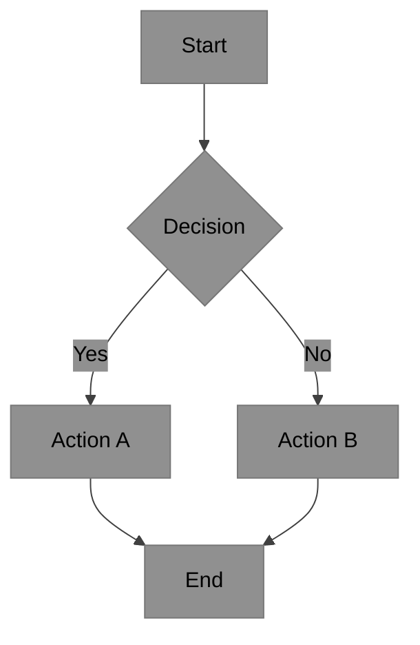
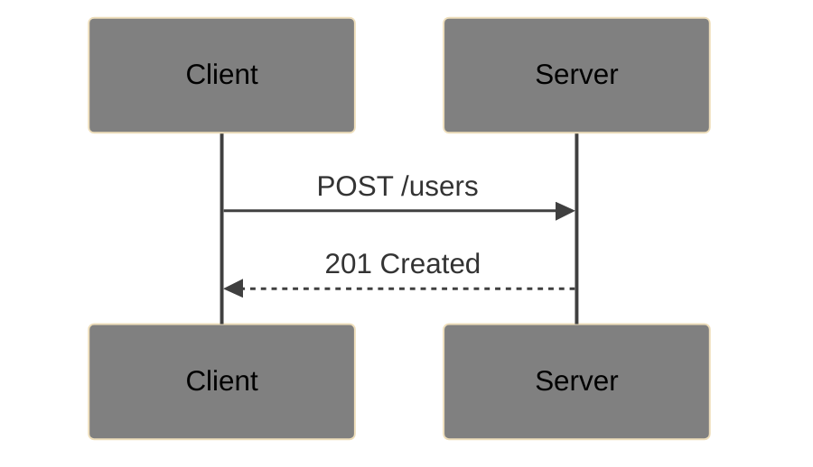
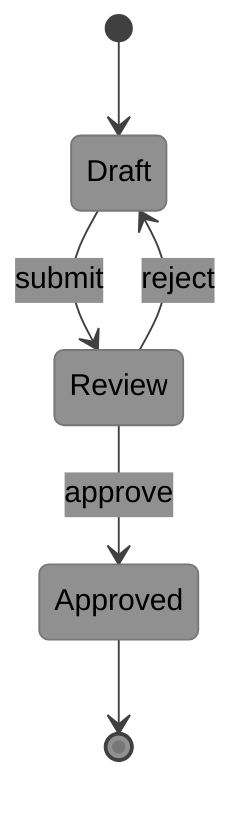

# Mermaid Diagram Standards

Legend (from RFC2119): !=MUST, ~=SHOULD, ≉=SHOULD NOT, ⊗=MUST NOT, ?=MAY.

**⚠️ See also**: [markdown.md](./markdown.md) | [main.md](../main.md)

## Standards

- ! Include `%%{init:...}%%` theme directive at the start of every Mermaid block
- ! Use the `base` theme with explicit grayscale overrides (not built-in themes)
- ~ Keep diagrams focused: one concept per diagram
- ~ Provide a text description or caption alongside every diagram
- ≉ Diagrams with >20 nodes — split into multiple focused diagrams
- ⊗ Relying solely on color to convey meaning (use labels and shapes too)
- ⊗ Low-contrast diagrams: missing theme init or light-on-light

## Color Palette

- `#909090` (medium gray) — primary nodes, note backgrounds — white text
- `#808080` (darker gray) — secondary nodes, actor backgrounds — white text
- `#707070` (darkest gray) — tertiary nodes — white text
- `#404040` (near-black) — lines, connectors, actor lines, signals
- `#000000` — all text labels on light backgrounds

## Init Directive (Required)

Prepend to every Mermaid block:

```
%%{init: {'theme': 'base', 'themeVariables': {
  'primaryColor': '#909090',
  'secondaryColor': '#808080',
  'tertiaryColor': '#707070',
  'primaryTextColor': '#000000',
  'secondaryTextColor': '#000000',
  'tertiaryTextColor': '#000000',
  'lineColor': '#404040',
  'noteTextColor': '#000000',
  'noteBkgColor': '#909090',
  'actorBkg': '#808080',
  'actorTextColor': '#000000',
  'actorLineColor': '#404040',
  'signalColor': '#404040'
}}}%%
```

For **state diagrams**, add to `themeVariables`:
```
'stateLabelColor': '#000000',
'compositeBackground': '#a0a0a0'
```

## Diagram Examples

### Flowchart


### Sequence Diagram


### State Diagram

